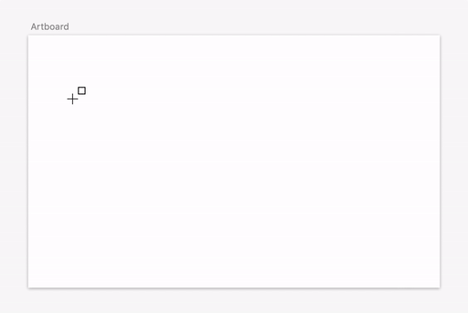

# sketch-wireframe-plugin
A plugin to create wireframe objects on Sketch

## Components
* Reactangle
* Button

## based on tutorial:
https://developer.sketch.com/plugins/create-a-plugin

<!-- @import "[TOC]" {cmd="toc" depthFrom=1 depthTo=6 orderedList=false} -->
